# Лабораторная работа №1

**Студент:** Якунин Андрей, ИТ-2
**Язык:** C#
**IDE:** JetBrains Rider
**.NET:** 10.0

## Описание

Лабораторная работа по процедурному программированию.
Реализованы 20 задач по четырём темам:

- **Задание 1. Методы** — 5 задач
- **Задание 2. Условия** — 5 задач
- **Задание 3. Циклы** — 5 задач
- **Задание 4. Массивы** — 5 задач

Решение оформлено в одном классе `Lab_1`, разделённом на два файла:

- `Lab_1.cs` — точка входа `Main` и меню выбора задачи
- `Lab_1.Methods.cs` — реализация всех методов

## Структура проекта

```
Lab_1/
├── Lab_1.cs            # Main, switch по номеру задачи
├── Lab_1.Methods.cs    # 20 методов с решениями
└── Lab_1.csproj
```

## Как запустить

```bash
dotnet run
```

После запуска вводится номер задачи (1–20), затем — данные согласно заданию.

---

## Задание 1. Методы

### Задача 1. Сумма последних двух цифр

**Метод:** `public int sumLastNums(int x)`

Возвращает сумму двух последних цифр числа.

**Пример:** `x = 4568` → `14`

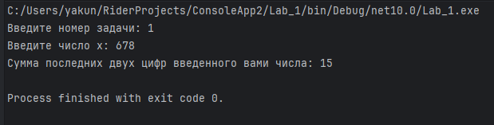

### Задача 2. Положительное число

**Метод:** `public bool isPositive(int x)`

Возвращает `true`, если число положительное.

**Пример:** `x = 3` → `true`, `x = -5` → `false`

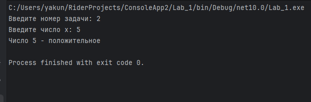

### Задача 3. Заглавная буква

**Метод:** `public bool isUpperCase(char x)`

Возвращает `true`, если символ — заглавная латинская буква.

**Пример:** `x = 'D'` → `true`, `x = 'q'` → `false`

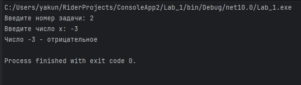

### Задача 4. Делитель

**Метод:** `public bool isDivisor(int a, int b)`

Возвращает `true`, если одно из чисел делит другое нацело.

**Пример:** `a = 3, b = 6` → `true`

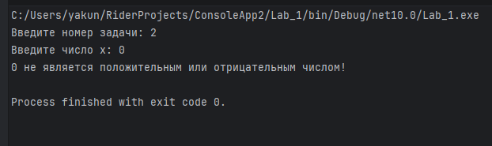

### Задача 5. Многократный вызов

**Метод:** `public int lastNumSum(int a, int b)`

Складывает последние цифры двух чисел. Последовательно применяется к пяти введённым числам.

**Пример:**

```
5 + 11 = 6
6 + 123 = 9
9 + 14 = 13
13 + 1 = 4
Итог: 4
```

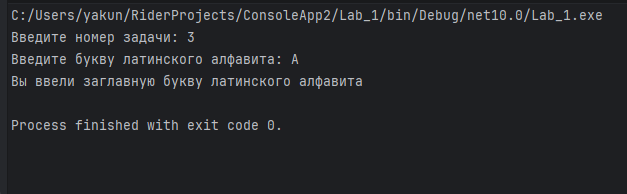

---

## Задание 2. Условия

### Задача 1. Безопасное деление

**Метод:** `public double safeDiv(int x, int y)`

Делит `x` на `y`, при `y = 0` возвращает `0`.

**Пример:** `x = 8, y = 2` → `4`

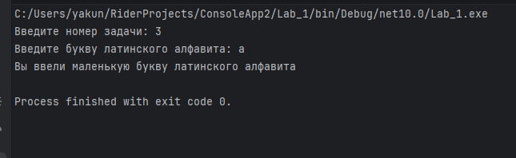

### Задача 2. Строка сравнения

**Метод:** `public String makeDecision(int x, int y)`

Возвращает строку с двумя числами и знаком `<`, `>` или `==`.

**Пример:** `x = 5, y = 7` → `"5 < 7"`

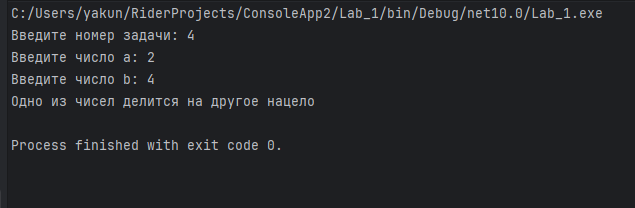

### Задача 3. Тройная сумма

**Метод:** `public bool sum3(int x, int y, int z)`

Возвращает `true`, если сумма двух чисел равна третьему.

**Пример:** `x = 5, y = 7, z = 2` → `true`

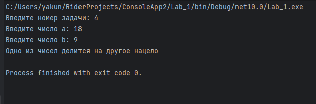

### Задача 4. Возраст

**Метод:** `public String age(int x)`

Возвращает строку вида `"5 лет"`, `"31 год"`, `"44 года"`.

**Пример:** `x = 31` → `"31 год"`

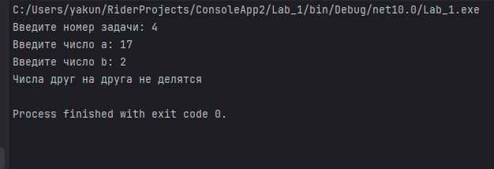

### Задача 5. Дни недели

**Метод:** `public void printDays(String x)`

Выводит название дня и всех последующих до воскресенья. Для неверной строки — `"это не день недели"`. Реализовано через `switch`.

**Пример:** `"четверг"` →

```
четверг
пятница
суббота
воскресенье
```

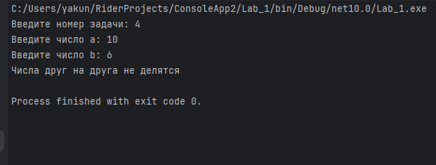

---

## Задание 3. Циклы

### Задача 1. Числа наоборот

**Метод:** `public String reverseListNums(int x)`

Возвращает строку со всеми числами от `x` до `0`.

**Пример:** `x = 5` → `"5 4 3 2 1 0"`

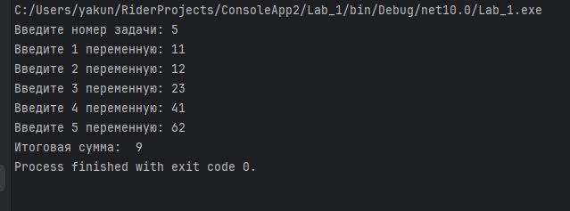

### Задача 2. Возведение в степень

**Метод:** `public int pow(int x, int y)`

Возвращает `x` в степени `y` через цикл умножения.

**Пример:** `x = 2, y = 5` → `32`

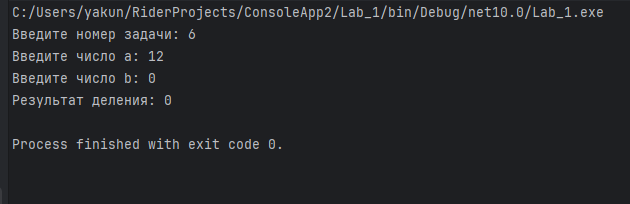

### Задача 3. Одинаковые цифры

**Метод:** `public bool equalNum(int x)`

Возвращает `true`, если все цифры числа одинаковы.

**Пример:** `x = 1111` → `true`, `x = 1211` → `false`

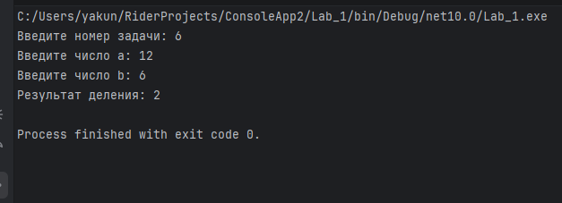

### Задача 4. Левый треугольник

**Метод:** `public void leftTriangle(int x)`

Выводит треугольник из `*`. В строке `i` — `i` звёздочек.

**Пример:** `x = 4` →

```
*
**
***
****
```

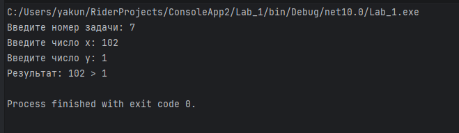

### Задача 5. Угадайка

**Метод:** `public void guessGame()`

Генерирует случайное число от 0 до 9. Пользователь угадывает, счётчик попыток выводится в конце.

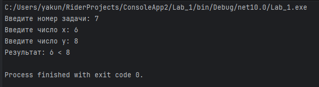

---

## Задание 4. Массивы

### Задача 1. Поиск последнего значения

**Метод:** `public int findLast(int[] arr, int x)`

Возвращает индекс последнего вхождения `x` или `-1`.

**Пример:** `arr = [1,2,3,4,2,2,5], x = 2` → `5`

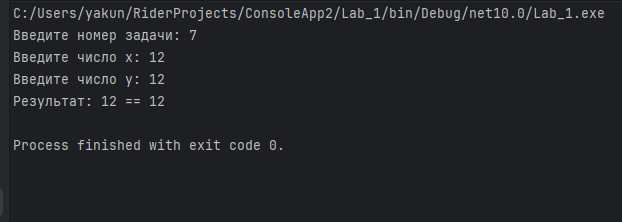

### Задача 2. Добавление в массив

**Метод:** `public int[] add(int[] arr, int x, int pos)`

Возвращает новый массив со вставленным в позицию `pos` элементом `x`.

**Пример:** `arr = [1,2,3,4,5], x = 9, pos = 3` → `[1,2,3,9,4,5]`

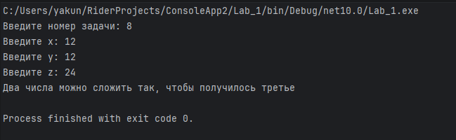

### Задача 3. Реверс

**Метод:** `public void reverse(int[] arr)`

Изменяет массив, записывая его задом наперёд.

**Пример:** `[1,2,3,4,5]` → `[5,4,3,2,1]`

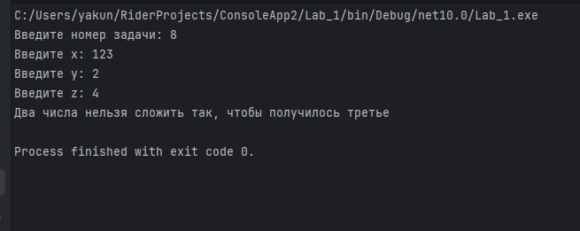

### Задача 4. Объединение

**Метод:** `public int[] concat(int[] arr1, int[] arr2)`

Возвращает новый массив: сначала `arr1`, затем `arr2`.

**Пример:** `[1,2,3] + [7,8,9]` → `[1,2,3,7,8,9]`

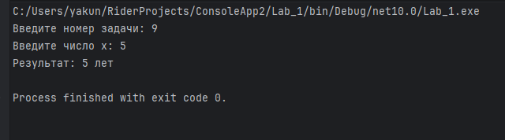

### Задача 5. Удаление негатива

**Метод:** `public int[] deleteNegative(int[] arr)`

Возвращает новый массив без отрицательных элементов.

**Пример:** `[1,2,-3,4,-2,2,-5]` → `[1,2,4,2]`

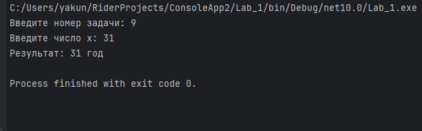

---

## Итог

- 20 задач реализованы и протестированы
- Все методы — в одном классе `Lab_1` (`partial class`)
- Точка входа — `Lab_1.Main()`
