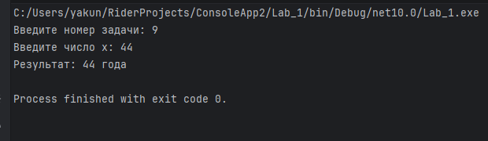
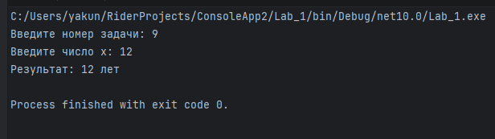
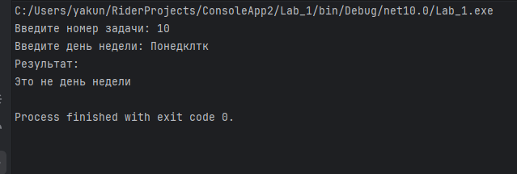
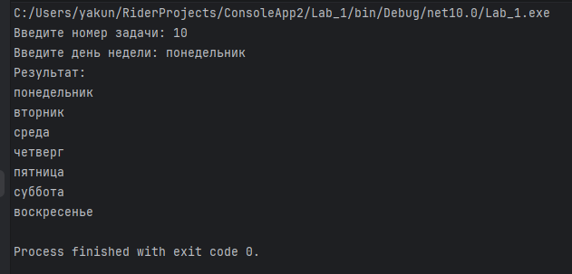
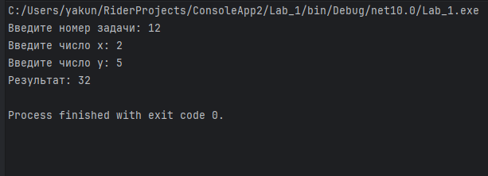
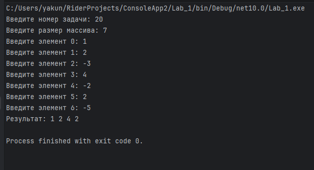

# Лабораторная работа №1

**Студент:** Якунин Андрей, ИТ-2
**Язык:** C#
**IDE:** JetBrains Rider
**.NET:** 10.0

## Описание

Лабораторная работа по процедурному программированию.
Реализованы 20 задач по четырём темам:

- **Задание 1. Методы** — 5 задач
- **Задание 2. Условия** — 5 задач
- **Задание 3. Циклы** — 5 задач
- **Задание 4. Массивы** — 5 задач

Решение оформлено в одном классе `Lab_1`, разделённом на два файла:

- `Lab_1.cs` — точка входа `Main` и меню выбора задачи
- `Lab_1.Methods.cs` — реализация всех методов

## Структура проекта

```
Lab_1/
├── Lab_1.cs            # Main, switch по номеру задачи
├── Lab_1.Methods.cs    # 20 методов с решениями
└── Lab_1.csproj
```

## Как запустить

```bash
dotnet run
```

После запуска вводится номер задачи (1–20), затем — данные согласно заданию.

---

## Задание 1. Методы

### Задача 2. Сумма последних двух цифр

**Метод:** `public int sumLastNums(int x)`

Из числа выделяются последняя и предпоследняя цифры с помощью операций остатка и целочисленного деления. Затем эти две цифры складываются и результат возвращается.

**Пример:** `x = 4568` → `14`


### Задача 4. Положительное число

**Метод:** `public bool isPositive(int x)`

Число сравнивается с нулём. Если `x` больше нуля, метод возвращает `true`, иначе `false`.

**Пример:** `x = 3` → `true`, `x = -5` → `false`


### Задача 6. Заглавная буква

**Метод:** `public bool isUpperCase(char x)`

Символ сравнивается с границами диапазона заглавных латинских букв A–Z. При попадании в диапазон возвращается `true`.

**Пример:** `x = 'D'` → `true`, `x = 'q'` → `false`


### Задача 8. Делитель

**Метод:** `public bool isDivisor(int a, int b)`

Для проверки делимости используется операция `%`. Проверяется, делится ли первое число на второе или второе на первое, с учётом невозможности деления по модулю на ноль.

**Пример:** `a = 3, b = 6` → `true`, `a = 2, b = 15` → `false`


### Задача 10. Многократный вызов

**Метод:** `public int lastNumSum(int a, int b)`

Пять введённых чисел обрабатываются последовательно: результат предыдущего вызова `lastNumSum` становится первым аргументом следующего вызова. После четырёх последовательных операций выводится итог.

**Пример:**

```
5 + 11 = 6
6 + 123 = 9
9 + 14 = 13
13 + 1 = 4
Итог: 4
```


---

## Задание 2. Условия

### Задача 2. Безопасное деление

**Метод:** `public double safeDiv(int x, int y)`

Сначала проверяется делитель `y`. Если он равен нулю, возвращается `0`. Иначе выполняется деление с результатом типа `double`.

**Пример:** `x = 5, y = 0` → `0`, `x = 8, y = 2` → `4`


### Задача 4. Строка сравнения

**Метод:** `public String makeDecision(int x, int y)`

Последовательно сравниваются `x` и `y`. В зависимости от результата выбирается знак `<`, `>` или `==`, после чего формируется строка с обоими числами.

**Пример:** `x = 5, y = 7` → `"5 < 7"`


### Задача 6. Тройная сумма

**Метод:** `public bool sum3(int x, int y, int z)`

Проверяются три возможных варианта: `x+y=z`, `x+z=y` и `y+z=x`. Если выполняется хотя бы одно равенство, возвращается `true`.

**Пример:** `x = 5, y = 7, z = 2` → `true`




### Задача 8. Возраст

**Метод:** `public String age(int x)`

Определяется последняя цифра числа и отдельно учитываются исключения 11–14. После этого выбирается нужное окончание: `год`, `года` или `лет`.

**Пример:** `x = 5` → `"5 лет"`, `x = 31` → `"31 год"`, `x = 44` → `"44 года"`





### Задача 10. Дни недели

**Метод:** `public void printDays(String x)`

Название дня определяется через `switch`. Для каждого допустимого дня выводятся он сам и все последующие дни до воскресенья. Для неизвестной строки используется вариант по умолчанию.

**Пример:** `"четверг"` →

```
четверг
пятница
суббота
воскресенье
```




---

## Задание 3. Циклы

### Задача 2. Числа наоборот

**Метод:** `public String reverseListNums(int x)`

При положительном `x` цикл идёт от `x` к `0` с уменьшением на единицу. Результаты последовательно добавляются в строку.

**Пример:** `x = 5` → `"5 4 3 2 1 0"`


### Задача 4. Возведение в степень

**Метод:** `public int pow(int x, int y)`

Создаётся начальное значение `1`. В цикле число `x` последовательно умножается на накопленный результат `y` раз.

**Пример:** `x = 2, y = 5` → `32`


### Задача 6. Одинаковые цифры

**Метод:** `public bool equalNum(int x)`

Последняя цифра сохраняется как эталон. Остальные цифры по очереди выделяются операциями `%` и `/` и сравниваются с эталоном.

**Пример:** `x = 1111` → `true`, `x = 1211` → `false`


### Задача 8. Левый треугольник

**Метод:** `public void leftTriangle(int x)`

Внешний цикл отвечает за номер строки. Внутренний цикл выводит количество символов `*`, равное номеру текущей строки.

**Пример:** `x = 4` →

```
*
**
***
****
```


### Задача 10. Угадайка

**Метод:** `public void guessGame()`

Генерируется случайное число от 0 до 9. Пользователь вводит варианты, после каждого ввода увеличивается счётчик попыток. Цикл завершается после совпадения введённого числа с загаданным.


---

## Задание 4. Массивы

### Задача 2. Поиск последнего значения

**Метод:** `public int findLast(int[] arr, int x)`

Массив просматривается по элементам. При каждом совпадении индекс сохраняется в переменную результата. После окончания перебора в ней остаётся индекс последнего совпадения либо `-1`.

**Пример:** `arr = [1,2,3,4,2,2,5], x = 2` → `5`


### Задача 4. Добавление в массив

**Метод:** `public int[] add(int[] arr, int x, int pos)`

Создаётся новый массив на один элемент больше исходного. Элементы до позиции копируются без сдвига, затем записывается `x`, после чего оставшиеся элементы исходного массива копируются со сдвигом на одну позицию.

**Пример:** `arr = [1,2,3,4,5], x = 9, pos = 3` → `[1,2,3,9,4,5]`


### Задача 6. Реверс

**Метод:** `public void reverse(int[] arr)`

Первый элемент меняется местами с последним, второй — с предпоследним и так далее до середины массива.

**Пример:** `[1,2,3,4,5]` → `[5,4,3,2,1]`



### Задача 8. Объединение

**Метод:** `public int[] concat(int[] arr1, int[] arr2)`

Создаётся новый массив размером, равным сумме размеров двух исходных массивов. Сначала копируются элементы `arr1`, затем элементы `arr2`.

**Пример:** `[1,2,3] + [7,8,9]` → `[1,2,3,7,8,9]`


### Задача 10. Удаление негатива

**Метод:** `public int[] deleteNegative(int[] arr)`

Сначала подсчитывается количество неотрицательных элементов. Затем создаётся новый массив нужного размера и в него последовательно копируются все элементы, которые не меньше нуля.

**Пример:** `[1,2,-3,4,-2,2,-5]` → `[1,2,4,2]`


---

## Итог

- 20 задач реализованы и протестированы
- Все методы — в одном классе `Lab_1` (`partial class`)
- Точка входа — `Lab_1.Main()`
