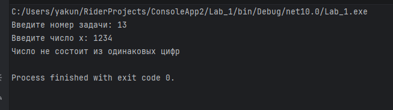
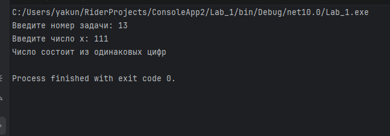
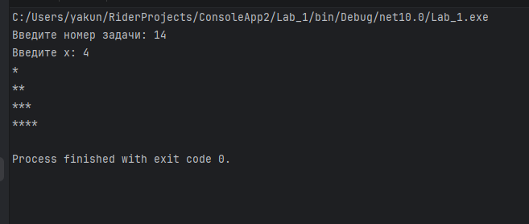
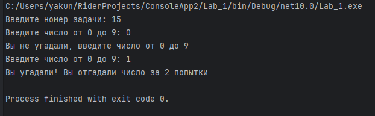
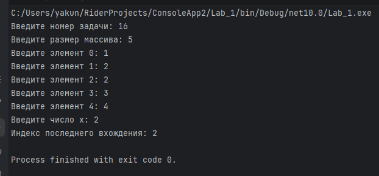
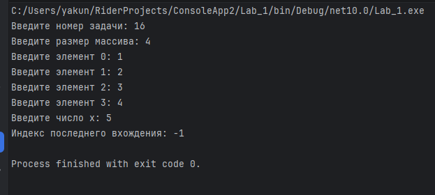
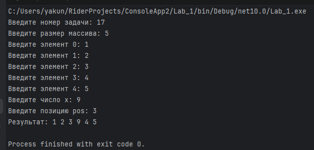
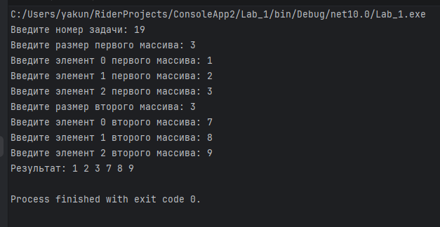

**Алгоритм решения**

Внешний цикл отвечает за номер строки. Внутренний цикл выводит количество символов `*`, равное номеру текущей строки.

**Тестирование**

Проверить значения 2 и 4 и сравнить форму полученного треугольника с примером.

Введите номер задачи: 14
Введите х: 2
*
**

Введите номер задачи: 14
Введите х: 4
*
**
***
****
*****

### Задача 10

**Текст задачи**

Дана сигнатура метода: `public void guessGame()`

Необходимо реализовать метод таким образом, чтобы он генерировал случайное число от 0 до 9, далее считывал с консоли введенное пользователем число и выводил, угадал ли пользователь то, что было загадано, или нет. Метод запускается до тех пор, пока пользователь не угадает число. После этого выведите на экран количество попыток, которое потребовалось пользователю, чтобы угадать число.

**Алгоритм решения**

Генерируется случайное число от 0 до 9. Пользователь вводит варианты, после каждого ввода увеличивается счётчик попыток. Цикл завершается после совпадения введённого числа с загаданным.

**Тестирование**

Сделать несколько неправильных попыток, затем угадать число и проверить отображение количества попыток.

Введите номер задачи: 15
Введите число от 0 до 9: 0
Вы не угадали, введите число от 0 до 9
Введите число от 0 до 9: 1
Вы угадали! Вы отгадали число за 2 попытки

---

## Задание 4. Массивы

### Задача 2

**Текст задачи**

Дана сигнатура метода: `public int findLast(int[] arr, int x);`

Необходимо реализовать метод таким образом, чтобы он возвращал индекс последнего вхождения числа `x` в массив `arr`. Если число не входит в массив – возвращается -1.

**Пример:** `arr = [1,2,3,4,2,2,5], x = 2` → `5`

**Алгоритм решения**

Массив просматривается по элементам. При каждом совпадении индекс сохраняется в переменную результата. После окончания перебора в ней остаётся индекс последнего совпадения либо -1.

**Тестирование**

Проверить массив с несколькими вхождениями `x` и массив без искомого значения.

Введите номер задачи: 16
Введите размер массива: 5
Введите элемент 0: 1
Введите элемент 1: 2
Введите элемент 2: 2
Введите элемент 3: 3
Введите элемент 4: 4
Введите число x: 2
Индекс последнего вхождения: 2

Введите номер задачи: 16
Введите размер массива: 4
Введите элемент 0: 1
Введите элемент 1: 2
Введите элемент 2: 3
Введите элемент 3: 4
Введите число x: 5
Индекс последнего вхождения: -1

### Задача 4

**Текст задачи**

Дана сигнатура метода: `public int[] add(int[] arr, int x, int pos);`

Необходимо реализовать метод таким образом, чтобы он возвращал новый массив, который будет содержать все элементы массива `arr`, однако в позицию `pos` будет вставлено значение `x`.

**Пример:** `arr = [1,2,3,4,5], x = 9, pos = 3` → `[1,2,3,9,4,5]`

**Алгоритм решения**

Создаётся новый массив на один элемент больше исходного. Элементы до позиции копируются без сдвига, затем записывается `x`, после чего оставшиеся элементы исходного массива копируются со сдвигом на одну позицию.

**Тестирование**

Проверить вставку значения в середину массива и сравнить новый массив с примером.

Введите номер задачи: 17
Введите размер массива: 5
Введите элемент 0: 1
Введите элемент 1: 2
Введите элемент 2: 3
Введите элемент 3: 4
Введите элемент 4: 5
Введите число x: 9
Введите позицию pos: 3
Результат: 1 2 3 9 4 5

### Задача 6

**Текст задачи**

Дана сигнатура метода: `public void reverse(int[] arr);`

Необходимо реализовать метод таким образом, чтобы он изменял массив `arr`. После проведенных изменений массив должен быть записан задом-наперед.

**Пример:** `arr = [1,2,3,4,5]` → `arr = [5,4,3,2,1]`

**Алгоритм решения**

Первый элемент меняется местами с последним, второй — с предпоследним и так далее до середины массива.

**Тестирование**

Проверить массив из пяти элементов и убедиться, что порядок элементов полностью изменился на обратный.

Введите номер задачи: 18
Введите размер массива: 5
Введите элемент 0: 1
Введите элемент 1: 2
Введите элемент 2: 3
Введите элемент 3: 4
Введите элемент 4: 5
Результат: 5 4 3 2 1

### Задача 8

**Текст задачи**

Дана сигнатура метода: `public int[] concat(int[] arr1, int[] arr2);`

Необходимо реализовать метод таким образом, чтобы он возвращал новый массив, в котором сначала идут элементы первого массива (`arr1`), а затем второго (`arr2`).

**Пример:** `arr1 = [1,2,3], arr2 = [7,8,9]` → `[1,2,3,7,8,9]`

**Алгоритм решения**

Создаётся новый массив размером, равным сумме размеров двух исходных массивов. Сначала копируются элементы `arr1`, затем элементы `arr2`.

**Тестирование**

Проверить два массива и убедиться, что итоговый массив содержит их элементы в заданном порядке.

Результат: 1 2 3 7 8 9

### Задача 10

**Текст задачи**

Дана сигнатура метода: `public int[] deleteNegative(int[] arr);`

Необходимо реализовать метод таким образом, чтобы он возвращал новый массив, в котором записаны все элементы массива `arr` кроме отрицательных.

**Пример:** `arr = [1,2,-3,4,-2,2,-5]` → `[1,2,4,2]`

**Алгоритм решения**

Сначала подсчитывается количество неотрицательных элементов. Затем создаётся новый массив нужного размера и в него последовательно копируются все элементы, которые не меньше нуля.

**Тестирование**

Проверить массив с положительными и отрицательными элементами и сравнить результат с ожидаемым.

Введите номер задачи: 20
Введите размер массива: 7
Введите элемент 0: 1
Введите элемент 1: 2
Введите элемент 2: -3
Введите элемент 3: 4
Введите элемент 4: -2
Введите элемент 5: 2
Введите элемент 6: -5
Результат: 1 2 4 2

